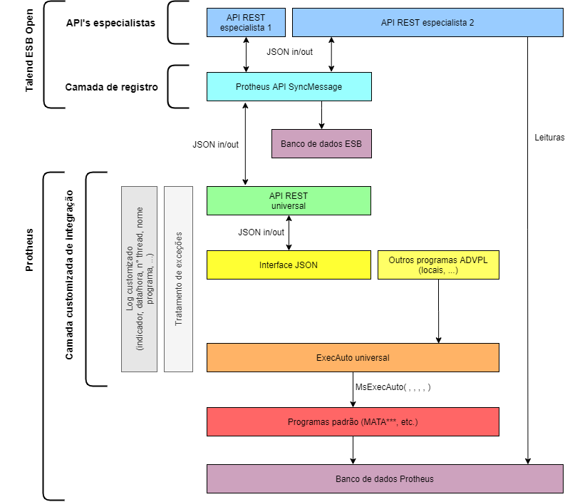

# Introdução

Esta API é uma coleção de métodos HTTP para interação com ERP TOTVS Protheus. Mais precisamente, para execução de operações através de rotina automática (*MsExecAuto*). Para isso, baseia-se nas API's SyncMessage (AtechESB Core) e AtechExecAuto (Protheus).

Cada um dos recursos nesta coleção é considerado uma **API especialista**, que se utiliza da **Camada Protheus de integração** ([API AtechExecAuto](https://automatech.stoplight.io/docs/AtechExecAuto)).

Cada API especialista é hospedada dentro do AtechESB, fazendo uso da **Camada de registro** ([API's core AtechESB](https://automatech.stoplight.io/docs/AtechESB)), de forma que cada transação fica registrada em banco de dados para possibilitar monitoramento e auditoria.

